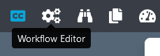

### Workflows

  
<b>How to create a new workflow?</b>

  

  Click on `Workflow Editor` view.

  

  Click on `+` button.

  

  Add some blocks and end your workflow with a `Delivery` block.

  Select the tool to use for each block (including ingest).

  

  Fill all red field in each block.

  

  Select some files to send on `Ingest block`.

  

  Click on execute workflow.

  

  
<b>Some blocks are red when I try to create a workflow.</b>

  

  If you see red blocks like the following screenshot, this means that you don't have right to use these blocks.

  Check your contract to see if the dates and tools should be available.

  Contact an administrator at `support@videomenthe.fr` if the blocks should be available.

  

  
<b>How to save a workflow?</b>

  

  Build or load a workflow.

  Click on `save` to save modifications on an existing workflow

  

  Click on `save as` to save as a new workflow. You will be asked to enter a name for this workflow.

  

  
<b>How to load an existing workflow?</b>

  

  Click on `Select a workflow`.

  

  Select the workflow you want to load.

### Library

  
<b>How to open the subtitle editing view?</b>

  

  Click on `Library` menu.

  

  Click on an `SRT` file.
  
  Only subtitles with .srt extension will show the subtitle editing interface.

  

