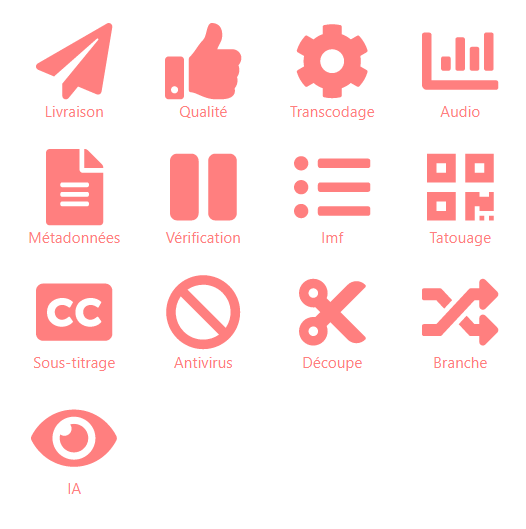
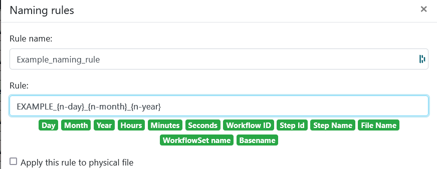
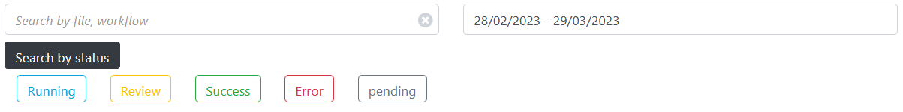
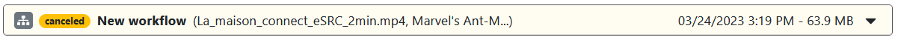
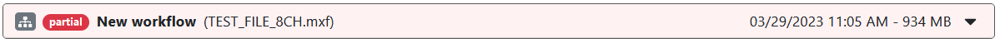
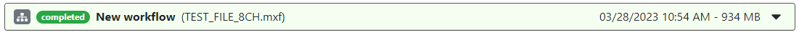
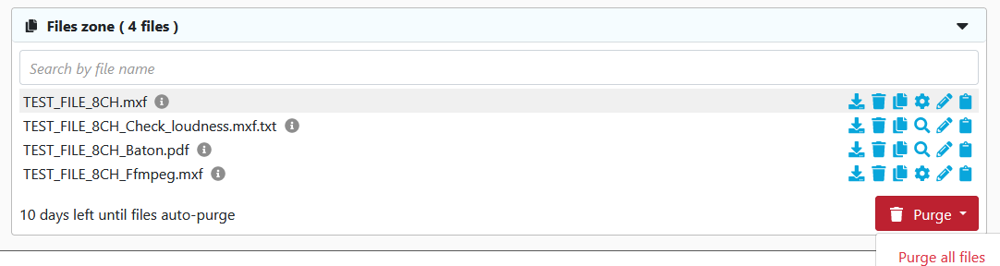
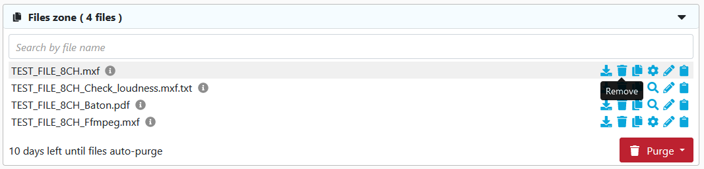

### Workflows Editor

  
<b>How to create a new workflow?</b>

  

  Click on `Workflow Editor` view.

  

  Click on `+` button.

  

  Add some blocks and end your workflow with a `Delivery` block.

  Select the tool to use for each block (including ingest).

  

  Fill all red field in each block.

  

  Select some files to send on `Ingest block`.

  

  Click on execute workflow.

  

  
<b>Presentation of all blocks</b>

  
**Ingest :** Allows to upload files to Eolementhe.
- Standard :  upload file with HTTPS protocol.
- Standard Object Storage : upload file from OVH, AZURE or AMAZON. 
- Server File : use file already present on the platform.
- Premium : upload file with Signiant App
- Premium Object Storage : upload file with Signiant App from OVH, AZURE or AMAZON.
- Internet : upload file by URL internet video.
- FTP : upload file with FTP protocol.
- Aspera : upload file with Aspera specific protocol.
- Live stream : upload file from live stream flux.
- Twitter : upload file from twitter publication
- Dropbox : upload file from DropBox account.

**Delivery :** Deliver the generated files (and sources if option added) of the workflow. 
- Manual : deliver file on Eolementhe platform.
- Object Storage : deliver file on OVH, AZURE or AMAZON.
- Mediashuttle : deliver file on mediashuttle portal.
- FTP export : deliver file on FTP instance.
- Youtube : deliver file on youtube account.
- Aspera connect : deliver file with Aspera protocol.
- Twitter :  deliver file on twitter account.
- Dropbox :  deliver file on dropbox account.

**Quality control :** Generates a quality control report in accordance with the preset entered. 
- Baton : Generate a quality control with Baton.
- Photon : Generate a quality control for package IMF.
- Mediainfo : Generate file with informations of media.

**Transcoding :** Generate a new media file in accordance with the preset entered.
- Harmonic WFS : Transcode file according to your Harmonic WFS workflows/presets.
- File360 : Transcode file on File360 service.
- RewrappAS10 : Rewrapp .mxf file with AS10 complient metadata.
- ffmpeg : Transcode file with ffmpeg.
- Titan File : Transcode file with Titan File.
- Cambria : Transcode file with Cambria.

**Loudness :** Generates or corrects errors in the soundtracks of the media file.
- Minnetonka ATS :  Check and fix loudness with Minnetonka.
- ffmpeg : Check and fix loudness with ffmpeg.

**Metadata :** Add or read metadatas to a media in accordance with the presets.
- Metadata : Add metadatas according to your preset.
- Auto retrieve : Retrieves metadatas from media files and generate file with metadatas.

**Pause :** Create a pause in the execution of tasks in the workflow.

**IMF :** Generate an IMF packages with .mxf file.

**Subtitle :** Generates, converts or writes subtitles on a media file.
- Convert : Convert subtitle files to another subtitle file format.
- Burn : Allows to integrate the subtitle file into a media file. 
- Translation Google : Generates subtitles with Google translation. 
- Translation Microsoft : Generates subtitles with Microsoft translation. 
- Translation Deepl :  Generates subtitles with Deepl translation. 
- Speech to text : Allows to create subtitles using the soundtrack of a media file with autosub.
- Speechmatics : Allows you to create subtitles using the soundtrack of a media file with Speechmatic.
- VideoIndexer : Allows you to create subtitles using the soundtrack of a media file with videoindexer.

**Antivirus :** Detects the presence of viruses in media files. 
- Clamav : Generate report with Clamav.

**Trim :** Allow to cut a media to the time codes specified by the user. 

**Expand :** Allow to modify the workflow with parallel or conditions.
- Parallel : Allow the user to create parallel branches to perform tasks simultaneously. 
- Conditional : Allows the user to create conditions on different branches for doesn't perform the same work according to the result of the previous block. 

**AI :** Allows to use artificial intelligence to detect faces, tags etc ...
- Videobox : Detects faces, nudity images and tags with Videobox.
- VideoIndexer :  Detects faces with VideoIndexer.

  
<b>Some blocks are red when I try to create a workflow.</b>

  

  If you see red blocks like the following screenshot, this means that you don't have right to use these blocks.

  Check your contract to see if the dates and tools should be available.

  Contact an administrator at `support@videomenthe.fr` if the blocks should be available.

  

  
<b>How to save a workflow?</b>

  

  Build or load a workflow.

  Click on `save` to save modifications on an existing workflow

  

  Click on `save as` to save as a new workflow. You will be asked to enter a name for this workflow.

  

  
<b>How to load an existing workflow?</b>

  

  Click on `Select a workflow`.

  

  Select the workflow you want to load.

  
<b>How to share a workflow?</b>

  
Sharing a workflow means that the users to whom you have shared your workflow will be able to load and use your workflow. But will not be able to modify it.

Load an existing workflow and click on `Share`.

In the modal you can share the workflow. And see the list of users to whom the workflow is shared.

View when you share your workflow. 

View when a workflow is shared with you. 

  
<b>How to use naming rule in my workflow?</b>

  
Click on  `Naming rule`.

](images/dropdown-manage.png)

Here you can add naming rules with your custom format. Enter the name of your rule and then you can write the format of naming you want for your files.

Here example of naming rule :

For adding variable in your name like "Days", "Months", "File Name" you just have to click on it.

After adding  naming rule, on each block appear this : 

So select your naming rule and this will be applied to all output files of the block. 

  
<b>How to notify someone ?</b>

  

You can notify the status of your workflow to other users with the recipient email feature. 

Recipient email appear in Pause and Delivery block. 

The  recipient email allows users added to had the same follow-up as the owner of the workflows (monitoring, notifications ...). 

Your own email adress is automatically add in recipient email list.

 You can search all users on platform and if user doesn't exist you can add it by writing his email address in the search bar and pressing enter. And you can supress an existing email from list by clicking in the red trash button.

### My Workflows

  
<b>Structure of monitoring view?</b>

The "My Workflows" view allow the user to monitor all the workflows you have started. 

The different buttons allows you to change the monitoring view. 

A button allow you to switch from the Workflow view to the File view. 

And the other button allow you to switch from the Standard view which corresponds to all workflows and files sent by the normal ingest. And the premium view that will show all the workflows and files sent by the premium ingest post (Premium mode use Signiant).

You can also filter your workflow list by dates, file name, file status, etc... Thanks to the two search bars. 

  
<b>Different state display in monitoring view ?</b>

Whether in the file or workflow motoring the steps are categorized by color codes corresponding to states.

Here is an exhaustive list of the different possible statuses. 

**Running :** the task is in execution and processing please wait for the end. 

**Refused :** the task was refused by the platform due to an unforeseen event or insufficient rights. 

**Paused :** the workflow include a Pause block so when the pause block is encountered, platform wait for the user to validate or refused the pause to continue. 

**Partial :** workflow are about executing and delivering correctly. But some tasks or files have not been executed correctly and are in error.
 

**Completed :** workflow are about executing and delivering correctly. All tasks or files in the workflow were executed correctly. 

  
<b>Anatomie of workflow monitoring view?</b>

In the workflow monitoring view you can have details of the progress of each workflow executed. 

First the name of the workflow used with the start date of the workflow and the total size of all source files and generated by the workflow. 

At top of the workflow zone we can see the title of file ingest. Below that show the progress and status of each task in your workflow, with the task information and the files generated by each task. 

The file zone. This area contains all the files in the workflow (sources files and generated files). It is also in this area that you will find the deletion information for the different files in your workflow. 

  
<b>Anatomie of file monitoring view?</b>

  
In the file monitoring view you can have details of the progress of each task on source file.

  
At top of the file zone we can see the title of source file. Below that show the progress and status of each task in your source file, with the task information and the files generated by each task. 

  
<b>How to purge file ?</b>

As specified in the monitoring workflows, the files have a deletion deadline. Each file created is kept on the platform for 5 days before it is automatically deleted. 

In addition, many options in workflow monitoring allow you to delete files related to a workflow. 

**Purge all files** that purge all sources and generates files of your workflow. 
**Purge source only** that purge all sources files of your workflow.  
**Purge generated only** that purge all generates files of your workflow. 
**Delete workflow** that removes all traces of the workflow on the platform (that delete : sources files, generates files and your workflow in monitoring view).

If you want to delete a specific file you can click on the trash icon of your target file in "My workflow" : 

### Library

  
<b>How to open the subtitle editing view?</b>

  
  Click on `Library` menu.

  

  Click on an `SRT` file.
  
  Only subtitles with .srt extension will show the subtitle editing interface.

  

If your view library does not include timecodes and other informations as above, you are in simplified view. You will just have to click on the button below : 

  
<b>How to contact an other user on platform ?</b>

  
On Eolementhe you can contact other user and talk to them. Messages are per file. Each file has its own messaging system and allows different users working on the same file to communicate simply.

To open the conversation on a file click on the icon indicated by the red arrows at the bottom right on the image below. 

And now communicate simply.

- Add Baton preset
- Add WFS preset
- Colaborate workflow pause after task with recipient email colab orator 
- File Library file stich / trim / information / IMF
- Library file subtilte editing precis tuto
- Folder ingest and outgest for block ingest/outgest
- Explique watchfolder
- Gérer une équipe 
- 2FA
- Dashboard explique ce qui y'a dans la fenetre et les filter
- Analitics create analitics