### Workflow Editor

  
<b>How to create a new workflow?</b>

  

  Click on `Workflow Editor` view.
  
 

Click on `+` button.

  

  Add some blocks and end your workflow with a `Delivery` block.

Select the tool to use for each block (including ingest).

  

Fill all red fields in each block.

  

Select some files to send on `Ingest block`.

  

Click on `Execute workflow`.

  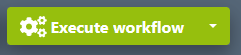
  

  
<b>Presentation of all blocks.</b>

**Ingest :** Allows to upload files to Eolementhe.

- ***Standard :***  upload file with HTTPS protocol.
- ***Standard Object Storage :*** upload file from OVH, AZURE or AMAZON. 
- ***Server File :*** use file already present on the platform.
- ***Premium :*** upload file with Signiant App.
- ***Premium Object Storage :*** upload file with Signiant App from OVH, AZURE or AMAZON.
- ***Internet :*** upload file by URL internet video.
- ***FTP :*** upload file with FTP protocol.
- ***Aspera :*** upload file with Aspera specific protocol.
- ***Live stream :*** upload file from live stream.
- ***Twitter :*** upload file from twitter publication.
- ***Dropbox :*** upload file from Dropbox account.

**Delivery :** Deliver the generated files (and sources if option added) of the workflow. 

- ***Manual :*** deliver file on Eolementhe platform.
- ***Object Storage :*** deliver file on OVH, AZURE or AMAZON.
- ***Mediashuttle :*** deliver file on mediashuttle portal.
- ***FTP export :*** deliver file on FTP instance.
- ***Youtube :*** deliver file on youtube account.
- ***Aspera connect :*** deliver file with Aspera protocol.
- ***Twitter :***  deliver file on twitter account.
- ***Dropbox :***  deliver file on dropbox account.

**Quality control :** Generates a quality control report in accordance to the preset entered. 

- ***Baton :*** Generate a quality control report with Baton.
- ***Photon :*** Generate a quality control report for  IMF package.
- ***Mediainfo :*** Generate report of technical metadata of the media file.

**Transcoding :** Generate a new media file in accordance to the preset entered.

- ***Harmonic WFS :*** Transcode file according to your Harmonic WFS workflows/presets.
- ***File360 :*** Transcode file on File360 service.
- ***RewrappAS10 :*** Rewrapp .mxf file with AS10 compliant metadata.
- ***ffmpeg :*** Transcode file with ffmpeg.
- ***Titan File :*** Transcode file with Titan File transcoder.
- ***Cambria :*** Transcode file with Cambria FTC transcoder.

**Loudness :** Generate or/and correct errors on audio tracks of the media file.

- ***Minnetonka ATS :***  Check and fix loudness with Minnetonka Audio Tools Server.
- ***ffmpeg :*** Check and fix loudness with ffmpeg.

**Metadata :** Create or read metadata to a media in accordance to your template.

- ***Metadata :*** Add metadatas according to your preset.
- ***Auto retrieve :*** Retrieves metadatas from media files and generate file with metadatas.

**Pause :** Create a pause in the execution of tasks in the workflow.

**IMF :** Generate an IMF package with `.mxf` file.

**Subtitle :** Generate, convert or burn subtitles on a media file.

- ***Convert :*** Convert subtitle files to another subtitle file format.
- ***Burn :*** Burn the subtitle file into a media file. 
- ***Translation Google :*** Generate subtitles with Google translation. 
- ***Translation Microsoft :*** Generate subtitles with Microsoft translation. 
- ***Translation Deepl :***  Generate subtitles with Deepl translation. 
- ***Speech to text :*** Generate subtitles from the audio tracks of a media file with Autosub.
- ***Speechmatics :*** Generate subtitles from the audio tracks of a media file with Speechmatics.
- ***Video Indexer :*** Generate subtitles from the audio tracks of a media file with Video Indexer.

**Antivirus :** Detect the presence of viruses in media files. 

- ***Clamav :*** Generate report with Clamav.

**Trim :** Cut a media to the time codes specified. 

**Expand :** Modify the workflow with parallel or conditional actions.

- ***Parallel :*** Create parallel branches to perform tasks simultaneously. 
- ***Conditional :*** Create conditional rules (if...then) on workflow . 

**AI :** Use of artificial intelligence to detect faces, tags etc ...

- ***Videobox :*** Detects faces, nudity images and tags with Videobox.
- ***Video Indexer :***  Detects faces with Video Indexer.

  
<b>Some blocks are red when I try to create a workflow.</b>

  

  If you see red blocks like the following screenshot, this means that you don't have right to use these blocks.

  Check your contract to see if the dates and tools should be available.

  Contact an administrator at `support@videomenthe.fr` if the blocks should be available.
  
If the blocks are not available but you want the new functionalities please contact the sales team at `contact@videomenthe.fr`.

  

  
<b>How to save a workflow?</b>

  

  Build or load a workflow.

  Click on `save` to save modifications on an existing workflow

  

  Click on `save as` to save as a new workflow. You will be asked to enter a name for this workflow.

  

  
<b>How to load an existing workflow?</b>

  

  Click on `Select a workflow`.

  

  Select the workflow you want to load.

  
<b>How to share a workflow?</b>

  

Sharing a workflow means that the users with whom you have shared your workflow will be able to load and use your workflow, but will not be able to modify it.

Load an existing workflow and click on `Share`.

In the pop-up you can add and choose the email of the user you want to share the workflow with.

View when you share your workflow. 

View when a workflow is shared with you. 

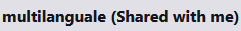

  
<b>How to use naming rule in my workflow?</b>

  

Click on  `Naming rule`.

Here you can add naming rules with your custom format. Enter the name of your rule and then you can write the template of naming you want for your files.

Here example of naming rule :

For adding variable in your name like `Days`, `Months`, `File Name` you just have to click on it.

After adding  naming rule, on each block appear this : 

So select your naming rule and this will be applied to all output files of the block. 

  
<b>How to notify someone?</b>

  

You can notify the status of your workflow to other users with the recipient email feature. 

Recipient email appears in Pause and Delivery block. 

The  recipient email allows users added to have the same follow-up as the owner of the workflows (monitoring, notifications, email ...). 

Your own email address is automatically added in the recipient email list.

 You can search all users on the platform and if the user doesn't exist you can add him by writing his email address in the search bar and pressing `Enter`. You can suppress an existing email from list by clicking in the red trash button.

  
<b>Good practices for collaborative workflow.</b>

If you want to create collaborative workflows, some good practices must be respected.

The easiest way is to use the pause block. At each pause all users in the email recipient list will have access to the file generated from the previous block. 

Thus all users in recipient list will receive an email giving them access to the file generated from the previous block. In addition, they will see the workflow in the monitoring view and  will be allow to edit the file library . They will also be able to continue or stop the workflow in the monitoring view. 

Let's take a simple example: 

A user starts a translation workflow. However, several translators must access to the file in order to be able to modify it. We create the following workflow: 

Once the workflow is paused, users in the recipient email list will be notified by email. They will receive the link to connect to the file library and to check the result of the previous block (here a Speech to text block). In this example they will just have to correct the subtitles file `.srt`. Once the corrections have been made, one of the users can simply  click on `Validate file and continue workflow`to make the workflow continue or click on `Stop workflow for this file` to abort the execution of the workflow (in `File library`on the file paused). 

  
<b>How to organize my file by folder?</b>

In the `ingest` and `delivery` block you can see a `Destination folder` field that allows you to organize these files with folders.

The `Destination folder` field of the Ingest block allows you to redirect all source files to the folder/subfolder you specify. 

The `Destination folder` field of the Delivery block allows you to redirect all generated files to the folder/subfolder you specify. 

If you leave the fields empty as below: 

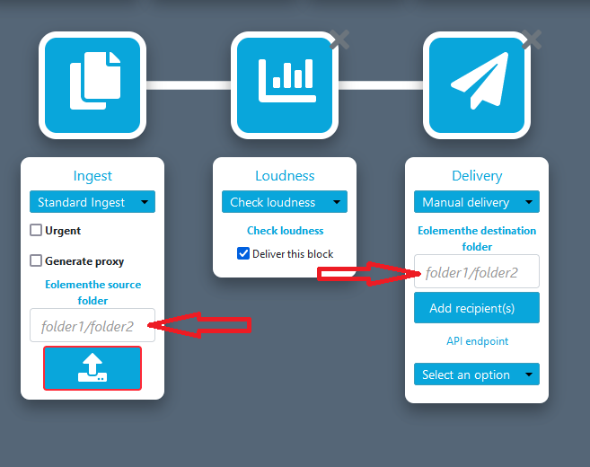

All your sources and generated files will be sent to the root of your Eolementhe file server.

If you specify the field `Destination folder` you will be able to classify your files simply. 

Example : 

Here we redirect all the source files to the `origin` folder, which is in the `test` folder. And we redirect all the generated files to the `loudness` folder which is in the `test` folder.

Result in the `File Library`: 

  
<b>How to create FTP watchfolder?</b>

An FTP WatchFolder allows you to specify a folder on an external FTP server. When adding files to this folder all the files added will be taken as source files and launched by Eolementhe in a workflow of your choice. 

At first you will need to add your FTP server. For that nothing simplier select the `FTP`or `FTP export` option in the ingest or delivery of your workflow.  

Click on `Add Server`

Fill in the data relating to your FTP server and click on `Submit`.

Now click on your login at the top right of Eolementhe and click on `FTP Watch Folder`.

Select the FTP container you just entered before. Select the folder that will be watched. And click on `Submit`.

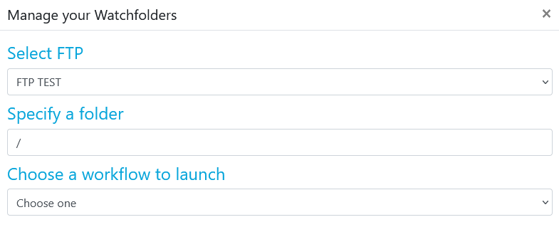

You should arrive on this page which lists all your Watchfolder folders that you have entered. This is also where you can delete FTP watchfolder by clicking on the red icon.

  
<b>How to add Baton preset?</b>

First add a `Quality Control` block to your workflow and choose `Baton`. 

If your preset list is empty, add a test plan by clicking on  `Add a test plan`.

Clicking again on `Add a test plan` and load your test plan. 

When your test plan is added click on `upload` to load your test plan on your profile. 

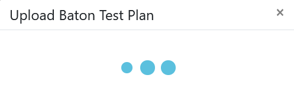

Once uploaded your test plan will be displayed in the list like this (here we add test plan named `aaaaaa`). You can delete or download your test plan from here.

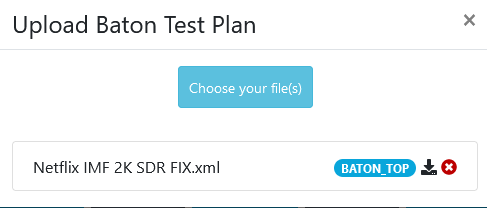

Return to your workflow and select the added test plan. 

  
<b>How to add Harmonic WFS preset?</b>

First add a `Transcoding`  block to your workflow and choose Harmonic WFS. 

If your preset list is empty, add a preset by clicking on  `Add Presets`.

Clicking on `Add Workflow` for add your workflow preset. 

When your workflow preset is added click  on `upload` to load.

Now add all presets used by your preset workflow and click `upload` again to load your preset on your profile. 

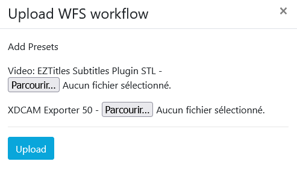

Once uploaded your preset will be displayed in the list like this (here we add preset named `EOLE_2`). You can delete or download your test plan from here.

Return to your workflow and select the added preset. 

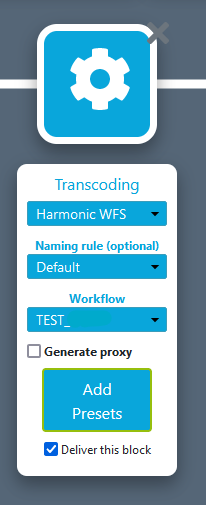

  
<b>Create and manipulate IMF packages.</b>

Create a workflow with an IMF package block and with your `.mxf` files in Ingest as below.

When your workflow is executed go to the `File library`. A folder with all these files building your IMF package is available.

Click on the label `IMF` in `File library` :

window will be opened :  

Eolementhe creates a default video. Choose the audi and video file you want to create your  new version. 

Once your media version have been created, click on the envelope icon as below : 

You will be redirected to a workflow with `Cambria` transcoding ready to generate your file.

### My Workflows

  
<b>Structure of monitoring view.</b>

  Click on `My Workflows` view.
  
  

The `My Workflows` view show all the workflows you have started. 

Different buttons can change the monitoring view. 

A button switch from the `My Workflow` view to the `My File` view. 

And the other button switch from the `Standard` view to `Premium` view. 
`Standard` view which corresponds to all workflows and files sent by the normal ingest. 
The `Premium` view that will show all the workflows and files sent by the premium ingest post (Premium mode use Signiant).

You can also filter your workflows list by date, file name, file status, etc... thanks to the two search bars. 

  
<b>Different state display in monitoring view.</b>

In the file or workflow motoring the steps are categorized by color codes corresponding to states.

Here is an exhaustive list of the different possible statuses. 

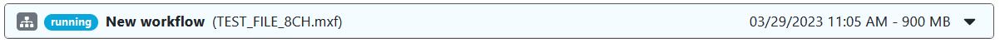

**Running :** the task is in execution and processing please wait the end. 

**Refused :** the task was refused by the platform due to an unforeseen event or insufficient rights. 

**Paused :** If Pause block is encountered, platform wait for the user to validate or refused the pause. 

**Partial :** workflow had execute all tasks but some tasks have not been executed correctly.
 

**Completed :** workflow  is execute and deliver correctly. All tasks of the workflow were executed correctly. 

  
<b>Anatomie of workflow monitoring view.</b>

In `My workflow` view you can unfold the details of your workflow by clicking on its name. 

Then we will be able to see two sub-menus. The first monitoring zone of the workflow and the second is the file zone.
As in the first step, unfold the two submenus.

Now you have the complete workflow monitoring view. You can have details of the progress of each tasks of your workflow executed. 

The name of the workflow used in list had specific name format like : 
Name of workflow - Start date of the workflow- Total size of all source and generated files.

At top of the workflow zone we can see the title of file ingest. And the progress and status of each task in your workflow, with the task information and the files generated by each task. 

The file zone  contains all the files in the workflow (sources files and generated files). It is also in this area that you will find all deletion informations for files of your workflow. 

  
<b>Anatomie of file monitoring view.</b>

Click on `My files` button.

In the file monitoring view you  have details of the progress of each task on the source file.

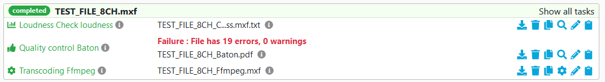
  
In the file zone we can see the title of source file. And that show the progress and status of each task on your source file.

  
<b>How to purge file?</b>

  

As specified in the  `My workflow` view, all files have a deletion deadline. Each file created is kept on the platform for 5 days before it is automatically deleted. 

In addition, many options in workflow monitoring allow you to delete files related to a workflow. 

**Purge all files** that purge all sources and generates files of your workflow.

**Purge source only** that purge all sources files of your workflow.

**Purge generated only** that purge all generates files of your workflow.

**Delete workflow** that remove all existence of the workflow on the platform ( delete : sources files, generates files and your workflow).

If you want to delete a specific file you can click on the trash icon of your target file in `My workflow` : 

### File Library

  
<b>Structure of file library view.</b>

  Click on `File Library` menu.

In the `File Library` view you have all the files related to your account. To open a file in the library, simply click on the file in this section.
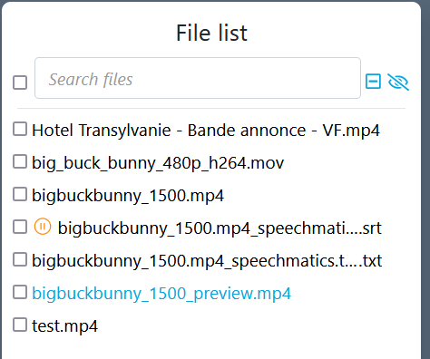    
You can search for a specific file or folder using the search bar. 

On hover this icon gives the information of the file: 

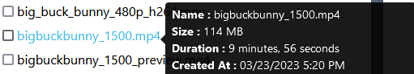

On hover this icon give quick view of the file: 

Source files are identifiable with the icon: 

Shared files are identifiable with the icon: 

When you select several files by checking them. An other menu appear just below.

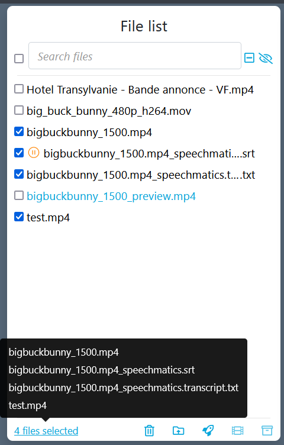
In this menu perform additional actions. 
First, you can delete the selected files. 

You can also send the files to another folder. 

And finally you can directly start a workflow with the selected files. 

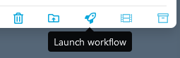

When you open file by clicking on it, the preview look like this: 

At top you can see the file title followed by the number of days remaining before the automatic purge. 

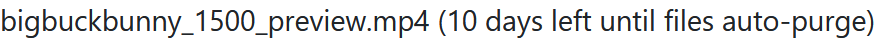

Then just below there are two icons. The first one is used to download the file, and the other one is used to delete the file.

Below the two icons you can see labels. These labels are clikable an redirect you on the workflow that contain this file. 

If you find that the preview video of the File library is too small to work comfortably you can click on the icon below to enlarge the view :

 

A small keyboard icon is above the video player. When you hover with your mouse, you will see the keyboard shortcuts of the video player. 

Below the video player, there are the basics control buttons: `Back, Pause, Forward and take a screenshot`.

There is also a video playback speed control bar. 

On the left of the video player you have a space reserved for captures, information and video cutting : 

`Captures view` list and manage all the screenshots taken on this file. 

`Information view` lists all available informations about a media file. You can also add metadata or export them. 
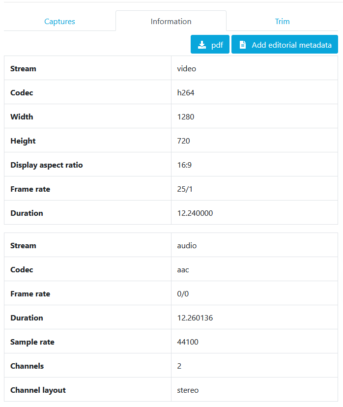

`Trim view`  trim parts of the media file. 

  
<b>How to do capture on file?</b>

  
Launch your video player. When you want to hang a capture press: 

In the menu `Captures`, the captures linked to the file are displayed and you can add a comment for your capture.

You can bring your video player to the frame of your capture by simply clicking on the timecode below the image.

 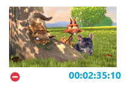

You can delete a capture by clicking on the icon: 

Finally you can export all your captures in `pdf` or `csv` format with the following two buttons :

  
<b>How to get informations of a file?</b>

In the tab `Information` you have the complete list of information about the file.  

  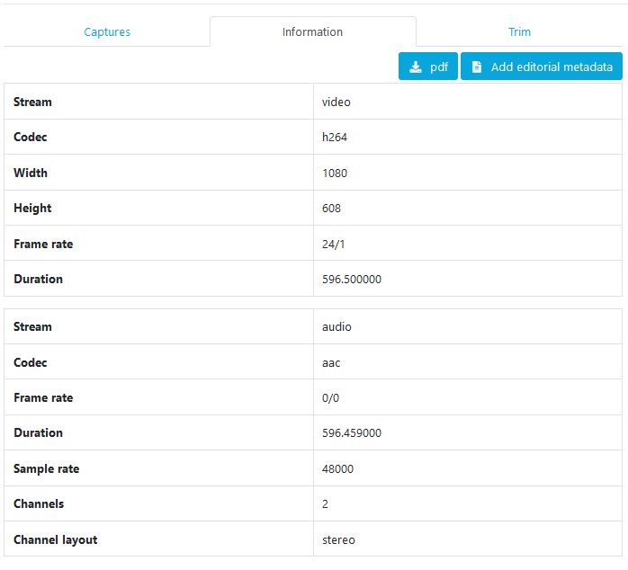
  

You have access to the metadata of the file (if there are any) : 

You can export the information in `.pdf` format or add metadata to the file using these buttons : 

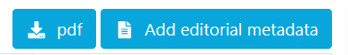

  
<b>How to trim a file?</b>

In the `Trim` menu you can extract a part of the media file. 

Enter two timecode that delimit the trim of your video . 

The timecode fields are automatically set to the timecode of your video being played back. 

Then click on `Trim`. 

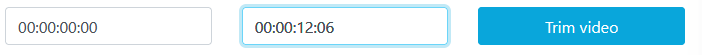

Wait a little while : 

Your file was created and named in the format `BaseName_trim_timecode1_timecode2` in your file Library.

  
<b>How to stitch files?</b>

In `File Library`, select several files with the same extension.

Option button appear `Stitch files`. That allow you to stitch selected file as you want.

Click on `Stitch File`.
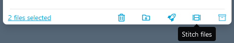

This will be displayed :

Add firstly a file by clicking on the icon: 

A view of your output file is displayed. Here you can see and modify the name of the output file.
And you can see the timeline of the new file that is going to be created by stitch.

Now let's add the second file. We can see on the timeline the white separation that marks the separation of our two files added.

You can reset your timeline by clicking on : 

Create the file by clicking on: 

  
<b>Structure of subtitle editing view.</b>

Click on `File Library` menu.

  

Click on an `SRT` file.

If your view library does not include timecode and other informations as above, you are in simplified view. You will just have to click on the button like below for complete view : 

The current captions of subtitle is displayed as follows.

If you click on the character limits a pop-up open allowing you to change the limits for all the file.

If you change the limit but some captions have more words per second than your limit they will appear in red like this : 

If you want to make your video player go on a particular caption, just click on the subtitles caption timecode surrounded in red below :

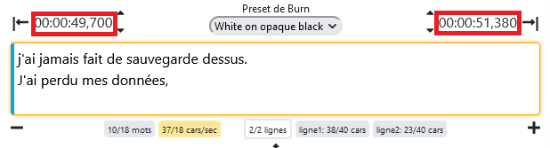

If you want to change the timecode you just have to click on the icon next to the timecode to change it (surrounded in red below) .

Clicking on vertical arrow icons bellow advance or reverse your caption by 100 milliseconds. 

You can delete a subtitles caption by clicking on the icon surrounded in red below.

You can add a caption by clicking on the icon surrounded in red below (the subtitles captions are added underneath the current)

By clicking on icons bellow you could advance or reverse by 100 milliseconds all subtitles captions of your file. 

When you have finished working on your subtitle, don't forget to save with the following button: 

  
<b>How to open the subtitle editing view?</b>

Click on `File Library` menu.

  

  Click on an `SRT` file.
  
  Only subtitles with `.srt` extension will show the subtitle editing interface.

  

If your view library does not include timecode and other informations as above, you are in simplified view. You will just have to click on the button below for complete view : 

  
<b>How to open subtitle editing side-by-side?</b>

  

Click on `File Library` menu.

  

  Click on an `SRT` file.
  
  Only subtitles with .srt extension will show the subtitle editing interface.
  

  
<b>How to contact an other user on platform?</b>

  
On Eolementhe you can contact other user and talk to them. This messaging system are per file. Each file has its own messaging system and allows different users working on the same file to communicate.

  Click on `File Library` menu and open your media file.

  

To open the conversation of file click on the icon indicated by the red arrows at the bottom right on the image below. 

And now communicate simply.

### Dashboard

  
<b>How to use dashboard effectively?</b>     
  

Click on `Dashboard` menu.  

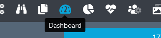

In the Dashboard view you can see all sources files with all tasks proceed by workflow in detail. 
The advantage of the dashboard is that there are many filter to apply.

You will have something like this: 

The select at top allows you to add or remove rows from the table. In order to customize your dashboard. 

Just below the first select, you can select your custom period : 

You can also change the way the rows of your table are ordered by clicking on the icon next to the name of the column you want to order : 

If you click on a file raw that redirect you on `File library` on the file you clicked : 

We also have labels in the State column corresponding to the workflow that was launched on the file. By clicking on this label the platform will redirect you to the `My Workflow` view monitoring on the clicked workflow. 

### Analytics

  
<b>How to use analytics effectively?</b>     

  Click on `Analytics` menu.  
  

Analytics allow to have a follow-up of the activity of user over a given period.

 Enter email of the user in filed and press ` Enter` and select a period.

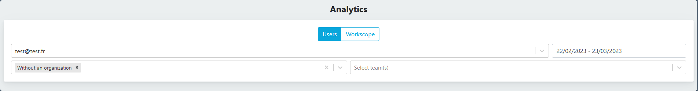

The list of selected emails is displayed. You can export the report as a `PDF` or `CSV` file with export buttons. 

Below example of one schema of the activity report.

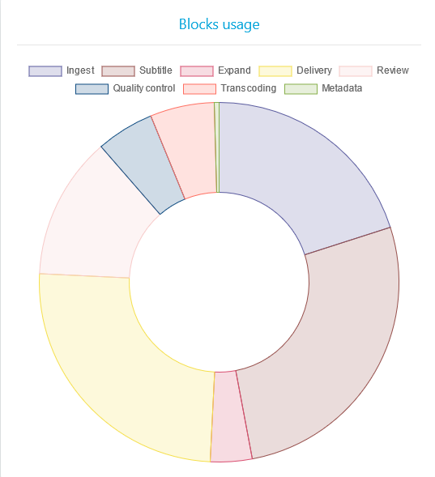

### Account

  
<b>How to more secure my account?</b>

  
  Click on your login at at the top right of Eolementhe. 
  Click on `Enable 2FA`.

After a modal will ask you: 

If you click on `yes` then you will activate the 2FA. 

If you active it next login on the platform you will be asked this: 

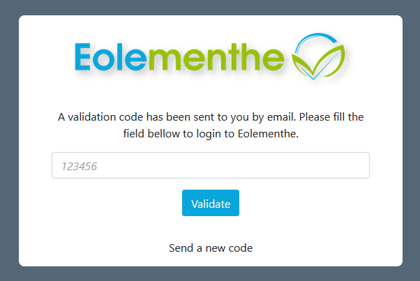
Code received on the email address of your Eolementhe account. 

  
<b>How to activate or disable notification?</b>

  Eolementhe can send notifications to your browser.
  
Click on your login at at the top right of Eolementhe. 
If disabled click on `Activate notification`.

If activated click on `Disable notification`.

  
<b>How to see my team?</b>

  Click on your login at at the top right of Eolementhe. 
  Click on `Teams`.

If a team exists it will be displayed like this.

  After that, just click on it to get all the information (if you are a simple user you can only see your team manager. Only manager can see all users of a team).

