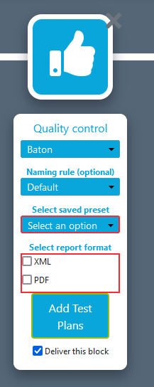
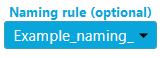

### Workflows

  
<b>How to create a new workflow?</b>

  

  Click on `Workflow Editor` view.

  

  Click on `+` button.

  

  Add some blocks and end your workflow with a `Delivery` block.

  Select the tool to use for each block (including ingest).

  

  Fill all red field in each block.

  

  Select some files to send on `Ingest block`.

  

  Click on execute workflow.

  

  
<b>Some blocks are red when I try to create a workflow.</b>

  

  If you see red blocks like the following screenshot, this means that you don't have right to use these blocks.

  Check your contract to see if the dates and tools should be available.

  Contact an administrator at `support@videomenthe.fr` if the blocks should be available.

  

  
<b>How to save a workflow?</b>

  

  Build or load a workflow.

  Click on `save` to save modifications on an existing workflow

  

  Click on `save as` to save as a new workflow. You will be asked to enter a name for this workflow.

  

  
<b>How to load an existing workflow?</b>

  

  Click on `Select a workflow`.

  

  Select the workflow you want to load.

  
<b>How to share a workflow?</b>

  
Sharing a workflow means that the users to whom you have shared your workflow will be able to load and use your workflow. But will not be able to modify it.

Load an existing workflow and click on `Share`.

In the modal you can share the workflow. And see the list of users to whom the workflow is shared.

  
<b>How to use naming rule in my workflow?</b>

  
Click on  `Naming rule`.

](images/dropdown-manage.png)

Here you can add naming rules with your custom format. Enter the name of your rule and then you can write the format of naming you want.

Here example of naming rule :

For adding variable like "Days", "Months", "FileName" you just have to click on it.

After adding one, on each block you can select the naming rule . 

This will be applied to all output files of the block. 

  
<b>How to notify someone ?</b>

  

You can notify the status of your workflow to other users. 

You can Add a user to the email recipients. Recipient Email select appear in Pause and Delivery block. 

The  recipient email allows users to be added so that they benefit from the same follow-up as the owner of the workflows (monitoring, notifications ...)

### Library

  
<b>How to open the subtitle editing view?</b>

  

  Click on `Library` menu.

  

  Click on an `SRT` file.
  
  Only subtitles with .srt extension will show the subtitle editing interface.

  

If your view library does not include timecodes and other information as above, you are in simplified views. You will just have to click on the button below : 

