### Workflows Editor

  
<b>How to create a new workflow ?</b>

  
  Click on `Workflow Editor` view.

  

Click on `+` button.

  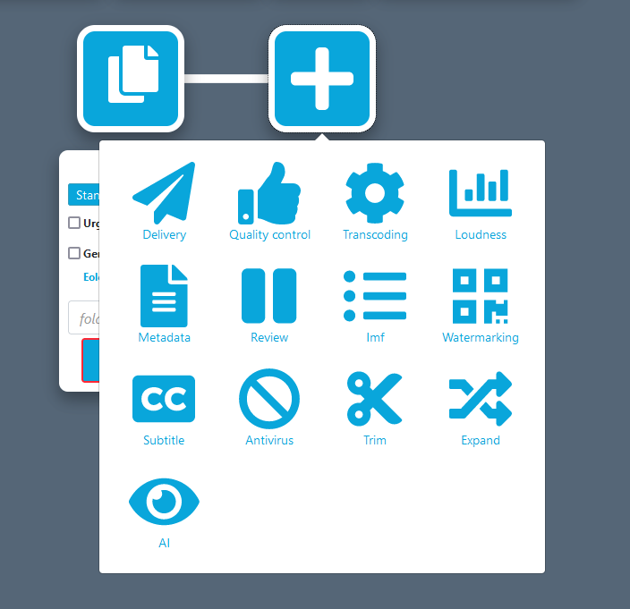

  Add some blocks and end your workflow with a `Delivery` block.

Select the tool to use for each block (including ingest).

  

Fill all red field in each block.

  

Select some files to send on `Ingest block`.

  

Click on execute workflow.

  

  
<b>Presentation of all blocks</b>

**Ingest :** Allows to upload files to Eolementhe.

- ***Standard :***  upload file with HTTPS protocol.
- ***Standard Object Storage :*** upload file from OVH, AZURE or AMAZON. 
- ***Server File :*** use file already present on the platform.
- ***Premium :*** upload file with Signiant App.
- ***Premium Object Storage :*** upload file with Signiant App from OVH, AZURE or AMAZON.
- ***Internet :*** upload file by URL internet video.
- FTP : upload file with FTP protocol.
- Aspera : upload file with Aspera specific protocol.
- Live stream : upload file from live stream flux.
- Twitter : upload file from twitter publication.
- Dropbox : upload file from DropBox account.

**Delivery :** Deliver the generated files (and sources if option added) of the workflow. 

- Manual : deliver file on Eolementhe platform.
- Object Storage : deliver file on OVH, AZURE or AMAZON.
- Mediashuttle : deliver file on mediashuttle portal.
- FTP export : deliver file on FTP instance.
- Youtube : deliver file on youtube account.
- Aspera connect : deliver file with Aspera protocol.
- Twitter :  deliver file on twitter account.
- Dropbox :  deliver file on dropbox account.

**Quality control :** Generates a quality control report in accordance with the preset entered. 

- Baton : Generate a quality control with Baton.
- Photon : Generate a quality control for package IMF.
- Mediainfo : Generate file with informations of media.

**Transcoding :** Generate a new media file in accordance with the preset entered.

- Harmonic WFS : Transcode file according to your Harmonic WFS workflows/presets.
- File360 : Transcode file on File360 service.
- RewrappAS10 : Rewrapp .mxf file with AS10 complient metadata.
- ffmpeg : Transcode file with ffmpeg.
- Titan File : Transcode file with Titan File.
- Cambria : Transcode file with Cambria.

**Loudness :** Generates or corrects errors in the soundtracks of the media file.

- Minnetonka ATS :  Check and fix loudness with Minnetonka.
- ffmpeg : Check and fix loudness with ffmpeg.

**Metadata :** Add or read metadatas to a media in accordance with the presets.

- Metadata : Add metadatas according to your preset.
- Auto retrieve : Retrieves metadatas from media files and generate file with metadatas.

**Pause :** Create a pause in the execution of tasks in the workflow.

**IMF :** Generate an IMF packages with `.mxf` file.

**Subtitle :** Generates, converts or writes subtitles on a media file.

- Convert : Convert subtitle files to another subtitle file format.
- Burn : Allows to integrate the subtitle file into a media file. 
- Translation Google : Generates subtitles with Google translation. 
- Translation Microsoft : Generates subtitles with Microsoft translation. 
- Translation Deepl :  Generates subtitles with Deepl translation. 
- Speech to text : Allows to create subtitles using the soundtrack of a media file with Autosub.
- Speechmatics : Allows you to create subtitles using the soundtrack of a media file with Speechmatic.
- VideoIndexer : Allows you to create subtitles using the soundtrack of a media file with videoIndexer.

**Antivirus :** Detects the presence of viruses in media files. 

- Clamav : Generate report with Clamav.

**Trim :** Allow to cut a media to the time codes specified by the user. 

**Expand :** Allow to modify the workflow with parallel or conditions.

- Parallel : Allow the user to create parallel branches to perform tasks simultaneously. 
- Conditional : Allows the user to create conditions on different branches for doesn't perform the same work according to the result of the previous block. 

**AI :** Allows to use artificial intelligence to detect faces, tags etc ...

- Videobox : Detects faces, nudity images and tags with Videobox.
- VideoIndexer :  Detects faces with VideoIndexer.

  
<b>Some blocks are red when I try to create a workflow</b>

  

  If you see red blocks like the following screenshot, this means that you don't have right to use these blocks.

  Check your contract to see if the dates and tools should be available.

  Contact an administrator at `support@videomenthe.fr` if the blocks should be available.

  

  
<b>How to save a workflow ?</b>

  

  Build or load a workflow.

  Click on `save` to save modifications on an existing workflow

  

  Click on `save as` to save as a new workflow. You will be asked to enter a name for this workflow.

  

  
<b>How to load an existing workflow ?</b>

  

  Click on `Select a workflow`.

  

  Select the workflow you want to load.

  
<b>How to share a workflow ?</b>

  
Sharing a workflow means that the users to whom you have shared your workflow will be able to load and use your workflow. But will not be able to modify it.

Load an existing workflow and click on `Share`.

In the modal you can share the workflow. And see the list of users to whom the workflow is shared.

View when you share your workflow. 

View when a workflow is shared with you. 

  
<b>How to use naming rule in my workflow ?</b>

  
Click on  `Naming rule`.

Here you can add naming rules with your custom format. Enter the name of your rule and then you can write the format of naming you want for your files.

Here example of naming rule :

For adding variable in your name like `Days`, `Months`, `File Name` you just have to click on it.

After adding  naming rule, on each block appear this : 

So select your naming rule and this will be applied to all output files of the block. 

  
<b>How to notify someone ?</b>

  

You can notify the status of your workflow to other users with the recipient email feature. 

Recipient email appear in Pause and Delivery block. 

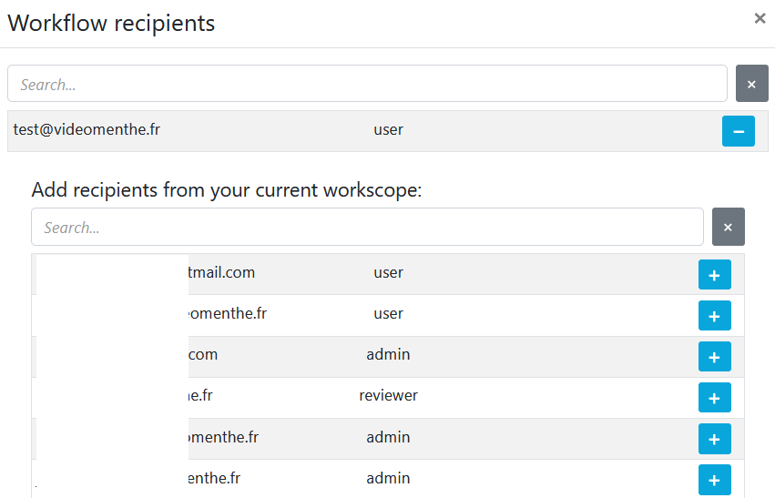

The  recipient email allows users added to had the same follow-up as the owner of the workflows (monitoring, notifications ...). 

Your own email adress is automatically add in recipient email list.

 You can search all users on platform and if user doesn't exist you can add it by writing his email address in the search bar and pressing enter. And you can supress an existing email from list by clicking in the red trash button.

  
<b>Good practices for collaborate in a workflow</b>

If you want to create collaborative workflows. Some good practices must be respected.

The easiest way is to use the pause block. At each pause all users in email recipient will have access to the file generated from the previous block. 

Thus all user in recipient will receive an email giving them access to the file generated from the previous block. In addition, they will see the workflow in the monitoring view and edit the file in library file. They will also be able to continue or stop the workflow in monitoring view. 

Let's take a simple example: 

A user starts a translation workflow. However, several translators must access the file in order to be able to correct it. We create the following workflow: 

Once the workflow is paused. Users in recipient email of the pause block receive the file from previous block (here a speech to text block). So they will just have to correct the subtitles file `.srt`. Once the corrections have been made, one of the users will simply have to continue the pause and the workflow will resume its execution with the corrected subtitle file.

  
<b>How to organize my file by folder ?</b>

In the `ingest` and `delivery` block you can see a `Destination folder` field that allows you to organize these files with folders.

The `Destination folder` field of the Ingest block allows you to redirect all source files to the folder tree you specified. 

The `Destination folder` field of the Delivery block allows you to redirect all generated files to the folder tree you specified. 

If you leave the fields empty as below: 

All your source and generated files will be sent to the root of your file server eolementhe.

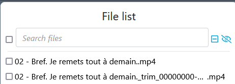

If you specify the field `Destination folder` you will be able to classify your files simply. 

Example : 

Here we redirect all the source files to the `eole` folder, which is in the `test` folder. And we redirect all the generated files to the `loudness` folder which is in the `test` folder.

Result in the `File Library`: 

  
<b>How to create FTP watchfolder ?</b>

An FTP WatchFolder allows you to specify a folder on an external FTP server. When adding files to this folder all the files added will be taken as source files and launched by eolementhe in a workflow of your choice. 

First you will need to add your FTP server. For that nothing simpler put the `FTP`or `FTP export` option in the ingest or delivery of your workflow.  

Click on `Add Server`

Fill in the data relating to your FTP server and click on `Submit`.

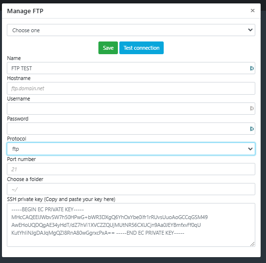

Now go to the dropdown menu at the top right of eolementhe and click on `FTP Watch Folder`.

Select the FTP container you just entered just before. Select the folder that will be watched. Select the folder that will be watched. And click on `Submit`.

You should arrive on this page which lists all your Watchfolder folders that you have entered. This is also where you can delete FTP watchfolder by clicking on the red icon.

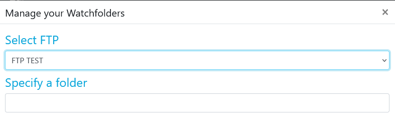

  
<b>How to add Baton preset ?</b>

First add a `Quality Control` block to your workflow. 

Baton with preset allow quality control according to your requirements. If your test plan list is empty.
You can add a test plan by click on  `Add a test plan`.

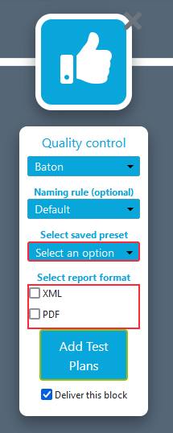

Clicking again on `Add a test plan` and load your test plan. 

When your test plan is added click on `upload` to load your test plan on your profile. 

Once uploaded your test plan will be displayed in the list like this (here we add test plan named `aaaaaa`). You can delete or download your test plan from here.

Return to your workflow and select the added test plan. 

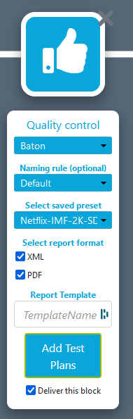

  
<b>How to add Harmonic WFS preset ?</b>

First add a `Transcoding`  block to your workflow. 

Harmonic WFS preset allow transcode according to your requirements. If your preset list is empty.
You can add a preset by click on  `Add Presets`.

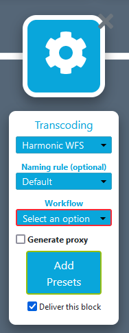

Clicking on `Add Workflow` for add your workflow preset. 
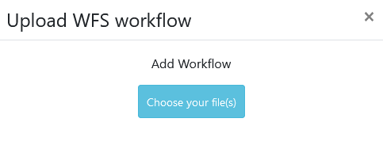

When your workflow preset is added click  on `upload` to load.

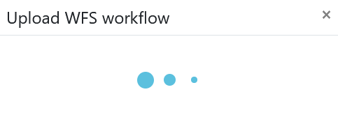

Now add all presets used by your preset workflow and click `upload` again to load your preset on your profile. 

Once uploaded your preset will be displayed in the list like this (here we add preset named `EOLE_2`). You can delete or download your test plan from here.

Return to your workflow and select the added preset. 

  
<b>Create and manipulate IMF packages</b>

Create a workflow with an IMF package block and with your `.mxf` file in Ingest as below.

When your workflow was executed go to the `File library`. You should have a folder with all of your MFI packages as below :

Click on the label `IMF` in `File library` :

This should open a window like the one below.

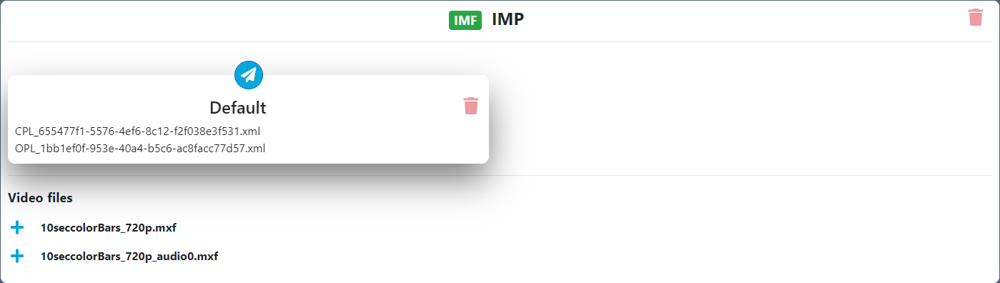

Eolementhe create a default video. But you can still create your own video with the settings you want with the list of all video files and all audio files. 

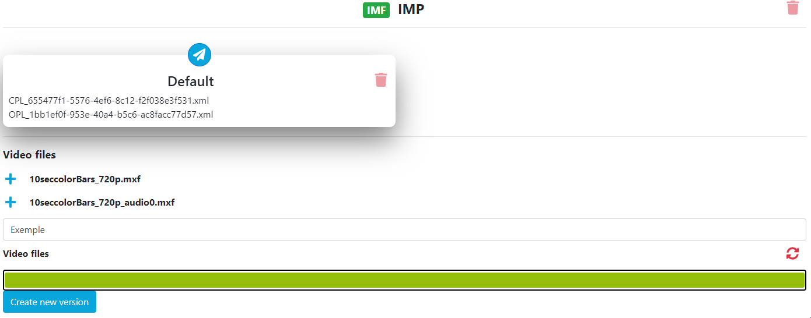

Once your media version have been created, you can click on the envelope icon as below : 

You will be redirected to a workflow with `Cambria` transcoding ready to generate your file.

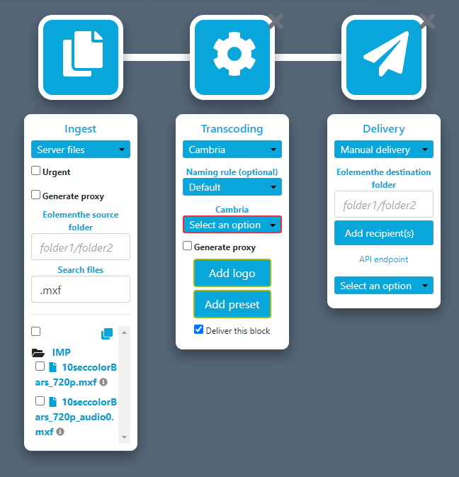

### My Workflows

  
<b>Structure of monitoring view ?</b>

  Click on `My Workflows` view.
  
  

The `My Workflows` view allow the user to monitor all the workflows you have started. 

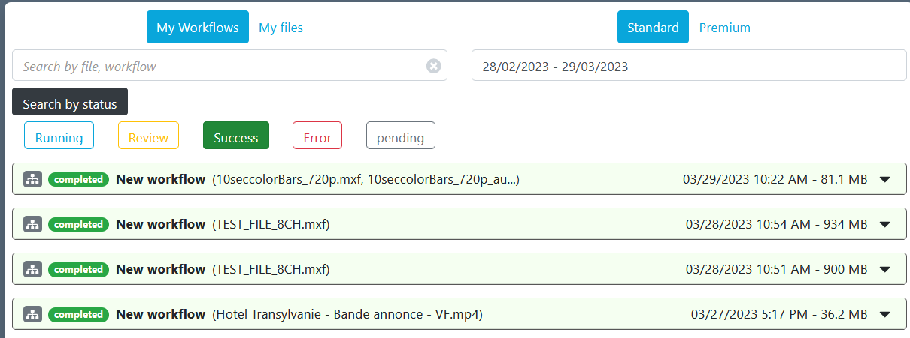

The different buttons allows you to change the monitoring view. 

A button allow you to switch from the `My Workflow` view to the `My File` view. 

And the other button allow you to switch from the `Standard` view which corresponds to all workflows and files sent by the normal ingest. And the `Premium` view that will show all the workflows and files sent by the premium ingest post (Premium mode use Signiant).

You can also filter your workflow list by dates, file name, file status, etc... Thanks to the two search bars. 

  
<b>Different state display in monitoring view ?</b>

Whether in the file or workflow motoring the steps are categorized by color codes corresponding to states.

Here is an exhaustive list of the different possible statuses. 

**Running :** the task is in execution and processing please wait for the end. 

**Refused :** the task was refused by the platform due to an unforeseen event or insufficient rights. 

**Paused :** the workflow include a Pause block so when the pause block is encountered, platform wait for the user to validate or refused the pause to continue. 

**Partial :** workflow are about executing and delivering correctly. But some tasks or files have not been executed correctly and are in error.
 

**Completed :** workflow are about executing and delivering correctly. All tasks or files in the workflow were executed correctly. 

  
<b>Anatomie of workflow monitoring view ?</b> 

First unfold the details of your workflow by clicking on its name in the list. 

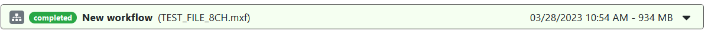

Then we will be able to see two sub-menus. Two different zones. The first monitoring zone of workflow and the second is the file zone. 
As in the first step, unfold the two submenus.

Now you have the complete workflow monitoring view you can have details of the progress of each tasks of your workflow executed. 

The name of the workflow used in list had specific format like : Name of workflow with the start date of the workflow and the total size of all source files and generated by the workflow. 

At top of the workflow zone we can see the title of file ingest. Below that show the progress and status of each task in your workflow, with the task information and the files generated by each task. 

The file zone. This area contains all the files in the workflow (sources files and generated files). It is also in this area that you will find the deletion information for the different files in your workflow. 

  
<b>Anatomie of file monitoring view ?</b>

  
  Click on `My files` button.

In the file monitoring view you can have details of the progress of each task on source file.

  
At top of the file zone we can see the title of source file. Below that show the progress and status of each task in your source file, with the task information and the files generated by each task. 

  
<b>How to purge file ?</b>

As specified in the monitoring workflows, the files have a deletion deadline. Each file created is kept on the platform for 5 days before it is automatically deleted. 

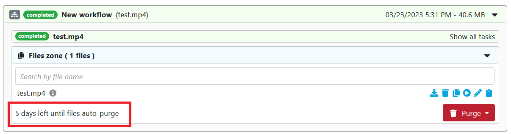

In addition, many options in workflow monitoring allow you to delete files related to a workflow. 

**Purge all files** that purge all sources and generates files of your workflow. 
**Purge source only** that purge all sources files of your workflow.  
**Purge generated only** that purge all generates files of your workflow. 
**Delete workflow** that removes all traces of the workflow on the platform (that delete : sources files, generates files and your workflow in monitoring view).

If you want to delete a specific file you can click on the trash icon of your target file in `My workflow` : 

### File Library

  
<b>Structure of file library view ?</b>

  Click on `File Library` menu.

In the `File Library` view we have on the left all the files related to our account. To open a file in the library, simply click on the file in this section.
    
You can search for a specific file or folder using the search bar. 

This icon gives the information of the file: 

This icon allows a quick view of the file: 

The source files are visible with the icon: 

Shared files are visible with the icon: 

You can select several files by checking them.

The selections allow you to perform additional actions. 
First, you can delete the selected files. 

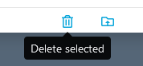

You can also send the files to another folder. 

And finally you can directly start a workflow with the selected files. 

Now open a file by a double click on this name, it opens on the right side of the library like this: 

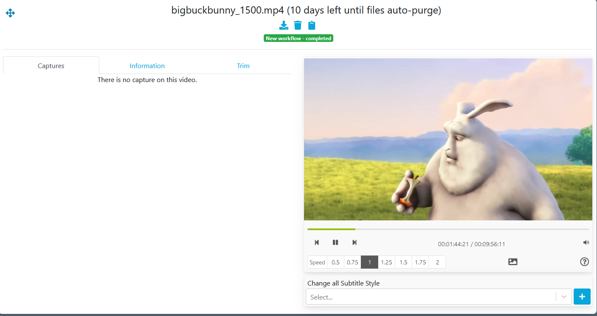

You can see the file title followed by the number of days remaining before the automatic purge. 

Then just below it there are two icons. The first one is used to download the file. And the other one is used to delete the file.

We also have labels corresponding to the workflow that was launched on the file. By clicking on this label the platform will redirect you to the workflow monitoring on the clicked workflow. 

If you find that the preview video of the File library is too small to work comfortably you can click on the icon below to enlarge the view :

 

A small keyboard icon is above the video player. When you hover your mouse over it, you will see the keyboard shortcuts of the player. 

Below the video player, there are the normal control buttons: `Back, Pause, Forward and take a screenshot`.

Below the video player, it also has a video playback speed control bar. 

On the left of the video player we have a space reserved for screenshots, information and video cutting : 

`Captures view` list and manage all the screenshots taken on this file. 

`Information view` lists all available information about the media file. And it also allows you to add metadatas or export them. 

`Trim view`  trim certain parts of this media file. 
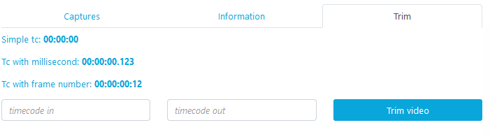

  
<b>How to do capture on file ?</b>

  
Launch your video player. When you want to hang a capture press: 

In the tab `Captures`, the captures linked to the file are displayed on the left of your player. Here you can directly comment them thanks to the field : 

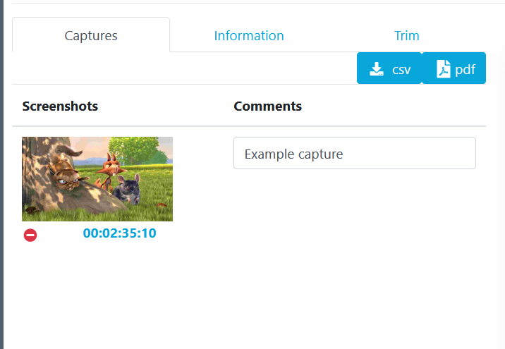

You can bring your video player to the frame of your capture click by simply clicking on the timecode below the image.

 

You can delete a capture by clicking on the icon: 

Finally you can export all your captures in `pdf` or `csv` format with the following two buttons :

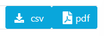

  
<b>How to get informations of a file ?</b>

  
In the tab `Information` you can have the complete list of information about the file.  

  
  

We also have access to the metadatas of the file (if there are any) : 

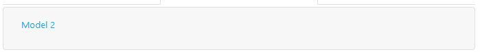

We can also export the information in `.pdf` format or add metadatas to the file using these buttons: 

  
<b>How to trim a file ?</b>

In the `Trim` tab you can extract a part of the media file. 
For that nothing simpler than two timecodes that delimit the trim of your video. 

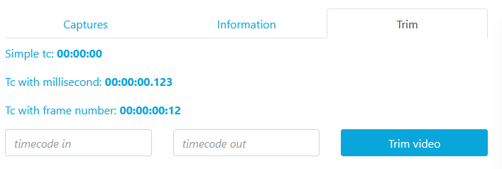

The timescode input fields are automatically set to the timecode of your video being played back. Then click on `Trim`. 

Wait a little while : 

Your file was created and named in the format `BaseName_trim_trim_timecode1_timecode2` in your file Library.

  
<b>How to stitch files ?</b>

  
In `File Library`, select several only files with the same extension by checking them.

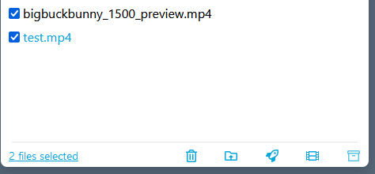

Option appears `Stitch files`. That stitch all selected file.

Stitch option had a specific interface for stitch our selected file.

First select the file to put first by clicking on the icon: 

A view of your output file is displayed. Here you can see the name of the output file. And we can see the timeline of our output file with our first file added. 

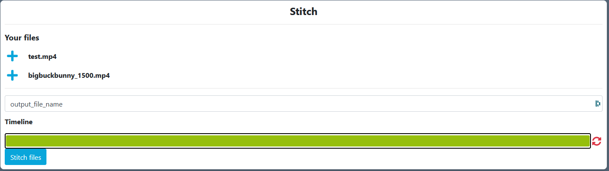

Now let's add the second file. We can see on the timeline the white separation that marks the separation of our two files added.

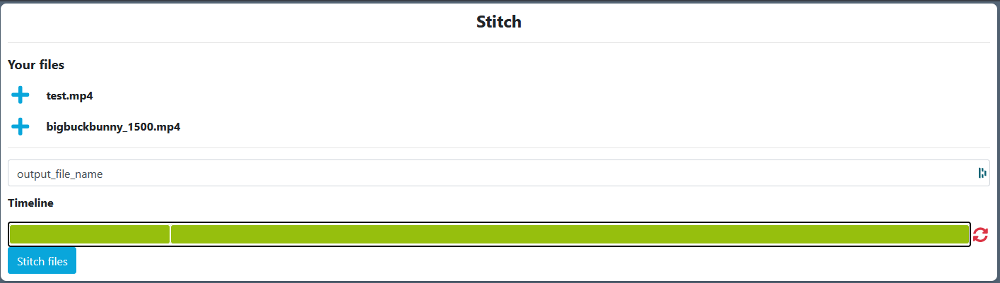

You can reset your timeline by clicking on : 

Or create the file by clicking on: 

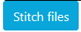

  
<b>Structure of subtitle editing view ?</b>

 
  Click on `File Library` menu.

  

 Click on an `SRT` file.

If your view library does not include timecodes and other informations as above, you are in simplified view. You will just have to click on the button like below for complete view : 

The current subtitle is displayed as follows.

If you click on the character limits a modal opens allowing you to change the limits for all the file.

If you change the limit and some captions have more words per second than your limit they will appear in red like this : 

If you want to put your media player on a particular caption, just click on the subtitles caption timecode surrounded in red below :

If you want to change the timecodes you just have to click on the icon (surrounded in red below) next to the timecode to change it.

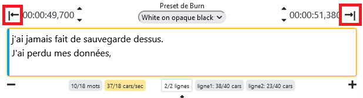

By clicking on icons bellow you could advance or reverse your capture by 100 miliseconds. 

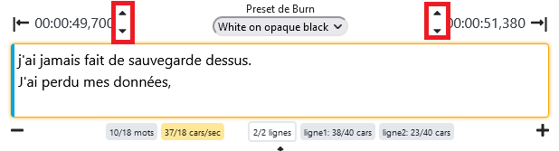

You can delete a subtitles caption by clicking on the icon surrounded in red below.

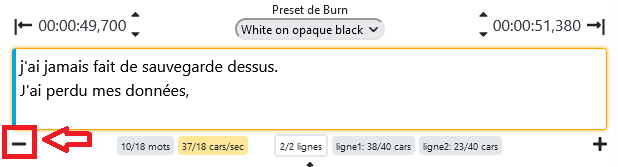

You can add a caption by clicking on the icon surrounded in red below (the subtitles captions are added underneath)

By clicking on icons bellow you could advance or reverse by 100 miliseconds all subtitles captions of your file. 

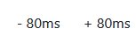

When you have finished working on your subtitles, don't forget to save with the following button: 

  
<b>How to open the subtitle editing view ?</b>

  
  Click on `File Library` menu.

  

  Click on an `SRT` file.
  
  Only subtitles with .srt extension will show the subtitle editing interface.

  

If your view library does not include timecodes and other informations as above, you are in simplified view. You will just have to click on the button below for complete view : 

  
<b>How to contact an other user on platform ?</b>

  
On Eolementhe you can contact other user and talk to them. This messaging system are per file. Each file has its own messaging system and allows different users working on the same file to communicate simply.

  Click on `File Library` menu and open your media file.

  

To open the conversation of file click on the icon indicated by the red arrows at the bottom right on the image below. 

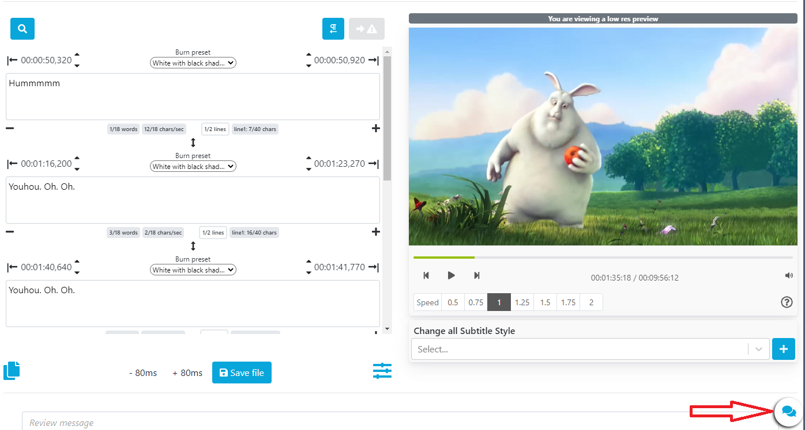

And now communicate simply.

### Dashboard

  
<b>How to use dashboard effectively ?</b>     

  
Click on `Dashboard` menu.  

In the Dashboard view you can see all the file with executed task in detail. 
The advantage of the dashboard is that there are many filters to apply to searches.

You will have something like this: 

If you click on a file raw that redirect your platform on `File library` on the file you clicked : 

The select allows you to add or remove rows from the table. In order to customize your dashboard and not have any information that is useless for you. 

Select your custom period : 

We can also change the way the rows of your table are ordered by clicking on the icon next to the name of the column we want to order : 

We also have labels in the State column corresponding to the workflow that was launched on the file. By clicking on this label the platform will redirect you to the `My Workflow` view monitoring on the clicked workflow. 

### Analytics

  
<b>How to use analytics effectively ?</b>     

  
Click on `Analytics` menu.  
  

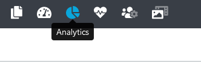

Analytics allow to have a follow-up of the activity of one or more users over a given period of time.

Select a user email and a period. 
Then an interface of the following form will be displayed : 

A list of selected emails is displayed. Allowing the management of our analytics.You can export report as a PDF or CSV file with both export buttons. 

Below example of one schema of the activity report.

### Account

  
<b>How to more secure my account ?</b>

  
Click on `Enable 2FA`.

After a modal will ask you: 

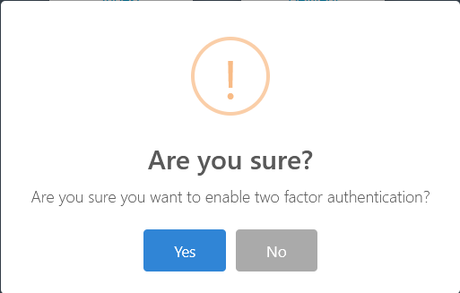

If you click on `yes` then you will activate the 2FA. 
 Next login on the platform you will be asked this: 

Code received by email to the email address of your account. 

  
<b>How to activate or disable notification ?</b>

  
If disabled click on `Activate notification`.

If activated click on `Disable notification`.

  
<b>How to see my team ?</b>

  Click on `Teams`.

If a team exists that behaves like this it will be displayed like this.

  After that, just click on it to get all the information (if u are a simple user you can only see your team manager. Only manager can see all users of team).
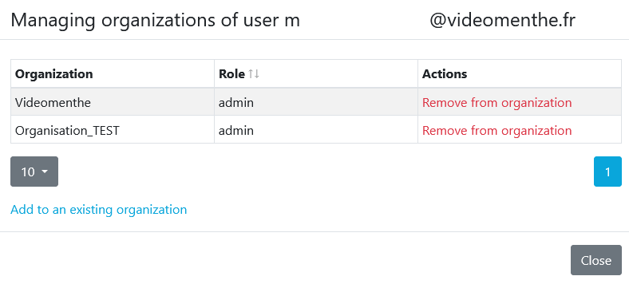

