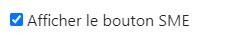
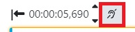
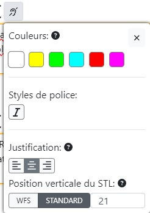

 

Ce guide n'est actuellement disponible qu'en francais.

 
### Bonnes pratiques à respecter pour l’édition de sous-titres FR et par défaut :

  
<b>Principales Guidelines.</b>

Cette liste est amenée à évoluer régulièrement.

*Composition des sous-titres*
- 2 lignes maximum
- Nombre de caractères par ligne :  
    * 40, espaces inclus
    * inférieur ou égal à 37 si présence de control code (ex : italique,…) 
    * ces indications peuvent être modifiées par projet : dans ce cas, respecter les seuils précisés par Videomenthe
- Les 2 lignes doivent être équilibrées en termes de caractère par ligne, en privilégiant une forme pyramidale.

*Durée*
- Ne pas placer de sous-titres dans les 10 premières images utiles d'un programme (400 premières ms).
- Durée minimale : 15 images (600ms) / maximale : 30 secondes, selon la taille des sous-titres.
- Laisser au moins 4 images (160ms) entre deux sous-titres.
- Supprimer le dernier sous-titre, au plus tard, 1 seconde avant la fin du programme. Ne jamais placer de sous-titre sur le programme Copyright.
- Les sous-titres doivent être synchronisés avec le son.

*Mise en forme / ponctuation*
- Utilisation des majuscules et minuscules.
- Les sous-titres ne doivent pas se chevaucher.
- Boucler une fin de phrase par un point final, un point d’exclamation, d’interrogation ou trois petits points.
- Utilisation du tiret (ajouter un espace entre le – et le premier caractère) lors de dialogues notamment
- L’italique doit être utilisé dans les cas suivants :
    * Voix off
    * Personne qui parle complétement hors champ (si hors champ puis dans le champ > pas d'italique)
    * Echange au téléphone (uniquement la personne hors champ)
    * Si tout le fichier est en voix off > pas d'italique.
- Ne pas utiliser les espaces pour positionner le texte, seulement la justification.
- Ne pas inclure de texte du programme dans le fichier de sous-titres. Ne pas remplir de champ supplémentaire ou ne pas créer de sous-titres de durée nulle.
- Ne pas ajouter d'espace entre le - et la première lettre.
- Préconiser la forme pyramidale si une ligne est plus longue que l'autre dans un sous-titre en deux lignes.
- Les sous-titres du narrateur/voix off doivent être en italique.
- Lorsqu’il y a des stt VO déjà présents à l’image, positionner les stt VOST juste au-dessus si possible, autrement les placer en haut de l’image.
- Lorsqu’il n’y a qu’une ligne dans un sous-titre il faut que la ligne soit le proche du bord de l’écran. Ainsi, par exemple, il convient d'ajouter une ligne vide (entrée) si le sous-titre est tout en bas de l'écran.

*Règles de fond*
- Respecter le sens du discours et règles d’orthographes, grammaire et conjugaison de la langue française.
- Faire attention à la césure, essayer de ne pas couper les phrases (si possible).
- Dans la mesure où la lecture est trop longue ou la césure mal placée, ne pas hésiter à adapter la traduction du discours. Mieux vaut adapter que d'avoir un sous-titre trop long ou une césure disgracieuse.
- Ne pas hésiter à créer des nouvelles captions pour que les captions ne soient pas surchargées.
- Le choix des mots est à la charge du traducteur.
- En cas de mots grossiers, les remplacer par des *** s’ils sont censurés (« bip »), sinon les transcrire.
- Conserver les valeurs de mesure de la VO : par exemple, un prix en $ ne doit pas être converti en €
- Divers textes incrustés peuvent nécessiter un sous-titrage (exemple : SMS, etc) et ne doivent jamais recouvrir ce texte incrusté : placez les sous-titres ailleurs dans l'image ou échelonnez-les dans le temps.
- Utilisez les options de placement disponibles dans la section SME. Le sous-titre doit gêner le moins possible l'image, ni étre situé sur un visage (nottament la bouche).

*Titre du programme*
- Ne pas traduire les titres génériques des programmes, uniquement les titres des épisodes d’une série qui seraient incrustés à l’image en VO. 
- Si le titre a une traduction, il sera communiqué.
- Afficher ce titre pendant au moins 4 secondes (si possible). Ce titre ne doit jamais recouvrir le titre original.

*Crédits*
- Placer le nom du fournisseur et du traducteur (Sous-titrage : Videomenthe – nom du traducteur) sur le carton du distributeur ou générique de fin, en perturbant le moins possible la lecture, sauf s'il s'agit d'un SME (si SME, le nom du traducteur n'est pas requis car pas d'adaptation, uniquement afficher : Sous-titrage : Videomenthe).

  

  
<b>Caractères autorisés.</b>

Les caractères autorisés sont : 

! ” % & ' ( ) * + , . - ; / : < > = ? #

1 2 3 4 5 6 7 8 9 0 

A B C D E F G H I J K L M N O P Q R S T U V W X Y Z 

a b c d e f g h i j k l m n o p q r s t u v w x y z 

é â à ç è ê ë ï î ô û ù ***

Tous les autres caractères sont interdits pour le français.

Pas de caractères spéciaux, (majuscules accentuées ou sigles ***£, $ et €*** par exemple) qui ne passent pas sur télétexte L1, y compris dans les metadata (infos export du fichier).
Norme : ***Teletext Level 1***

  
<b>Abréviations.</b>

- ***Les Heures*** : 
Durée : en toutes lettres (ex : 3 heures).
Temps : en contracté (ex : à 17h30).

- ***Monsieur, Madame, Mademoiselle*** : Concaténés s’ils sont suivis du nom de famille ou du titre (Mlle, M. et Mme) et en toutes lettres pour le reste.

- ***Mesures*** : 10 mètres s’il y a la place ou 10 m.

- ***Pourcentages*** : 100 % (si caractère % autorisé en Télétexte).

- ***Température*** : En toutes lettres si le caractère ne passe pas sur Télétexte.

- ***Siècles et Rois*** : ils seront en chiffres romains.

- ***Classement*** : Premier en toutes lettres s’il y a la place, sinon 1er ou 1ère …

  
<b>Métadonnées du fichier STL.</b>

Métadonnées obligatoires dans le fichier d'en-tête STL :

- Language Code
- Original program title (fourni) 
- Original episode title (fourni) 
- Translated program title (fourni) 
- Translated episode title (fourni) 
- Translator name
- Country of origin (fourni) 
- Modification Date

 

### Directives supplémentaires pour le sous-titrage à destination des sourds et les malentendants SME :

  
<b>Guidelines supplémentaires SME.</b>

Le sous-titrage destiné spécifiquement aux personnes malentendantes doit respecter ces règles : 

- Respecter l'image : ne couvrez pas le texte incrusté, les zones importantes de l'image ni les visages (nottament la bouche).
- Utiliser toujours des tirets (-) pour indiquer que le locuteur a changé. Pas d’espace après.
- Placer les sous-titres le plus proche de la source sonore.
- Respecter le code couleurs défini pour le sous-titrage (cf couleurs).
- Pas d'italique pour un sous titre SME (cf couleurs).
- Utiliser des parenthèses pour les chuchotements ou les conversations privées.
- Utiliser des majuscules lorsque plusieurs personnes récitent le même texte (et utiliser des minuscules pour tout le reste, sauf pour des abréviations, des acronymes spécifiques).
- Décomposer les phrases de manière intelligible. Lorsqu'une phrase s'étend sur plus d'une caption, décomposez-la à l’endroit approprié pour éviter tout contresens.
- La durée du sous-titre doit être d'au moins 15 images pour une bonne lecture et compréhension.
-	Les caractères spéciaux sur majuscules ne sont pas autorisés : pas de 'E' avec accent, de 'C' avec cédille, etc...
- Si une phrase se lit sur deux sous-titres consécutifs, l'écart entre ces derniers doit être de 4 images.
- Si une musique est citée puis continue sur un autre plan, il faut noter trois petits points en magenta.
-	Si un bruit est décrit, puis continue sur un autre plan, il faut noter trois petits points en rouge.
-	Le bruitage doit être décrit uniquement s'il n'est pas visible à l'image.
-	Il faut faire une adaptation, par exemple ne pas écrire les mots répétés.
-	Privilégier la compréhension globale du sous-titre plutot que la syncronisation.
- Dans le cas d'un SME, afficher uniquement le nom du fournisseur dans les crédits (Sous-titrage : Videomenthe)

  
<b>Couleurs.</b>

Respect du code couleur défini :

- ***Blanc*** lorsque le locuteur est visible (même partiellement) à l'écran.
- ***Jaune*** lorsque le locuteur n’est pas visible (hors champ) ou pour les voix off.
- ***Rouge*** indique des effets sonores. 
Un astérisque (*) est utilisé pour tous les sons provenant de : haut-parleur, radio, télévision, téléphone… 
L’astérisque sera de la couleur du sous-titre. Il n’y a pas d’espace avant le sous-titre. 
- ***Vert*** indique une langue étrangère (par exemple "dialecte indien…").
Ne traduisez pas cette langue et ne la transcrivez que si les mots étrangers sont très bien connus.
- ***Cyan*** indique des pensées non dites ou des flashbacks (les téléspectateurs entendent les pensées du
personnage mais sa bouche ne bouge pas).
Le cyan est utilisé pour les séquences de narration dans les documentaires et reportages. 
- ***Magenta*** est utilisé pour les indications musicales et les paroles d'une chanson.

  
<b>Positionnement des sous titres.</b>

- Positionner les sous-titres de manière à permettre aux téléspectateurs de situer l'orateur. 
- Placer les sous-titres sous l'orateur et gardez la 1ère ligne plus courte que les autres si possible.
- Lorsque l'orateur est en arrière-plan entouré d'autres personnes, placez les sous-titres au-dessus de lui.
- Positionner les sous-titres en fonction de la source sonore. Si aucune source n'est identifiée, centrez les sous-titres. 
- Préférer la première captions plus courte que la seconde si possible, néanmoins la césure par la ponctuation prime toujours.
- La découpe des sous-titres doit correspondre au maximum au changement de plan, par exemple lorsqu'une perdonne parle arrive a l'écran changez de caption et utiliser la couleur adéquat.

  
<b>Composition des captions.</b>

- ***Silence*** : Si le silence dépasse 20 secondes, placez 3 points blancs (sans espace), justifiés à gauche pendant toute la durée de cette séquence.
- ***Phrases*** : Lorsque les phrases s'étendent sur plus d'une ligne de caption, ajoutez 2 points (..) à la fin d'une ligne et au début de la suivante (sans espace entre les deux). 
- ***Autre ponctuation*** : Lorsque des indications concernant la musique ou d'autres effets sonores forment des phrases complètes, ponctuez-les comme telles. 
Par exemple : Téléphone ou Le téléphone sonne. 
- ***Dialogue*** :Utiliser une ligne à simple interligne pour séparer deux lignes de légende à double hauteur.
Placez un tiret sans espace entre les deux lorsque le haut-parleur change. 
Lorsque la même personne reprend la parole après une période de silence, ou après de la musique ou d'autres effets sonores, n'utilisez plus le tiret.
- ***Début du programme*** : Tous les programmes commencent par 3 points (sans espace) justifiés à gauche pendant toute la durée du générique d'ouverture, afin que le téléspectateur sache que le sous-titrage du télétexte fonctionne correctement. 
- ***Fin de programme*** : Indiquez la fin des sous-titres du programme avec la signature (Sous-titrage : Videomenthe – nom du traducteur) lors du générique de clôture. 
- ***Niveau de langue*** : Transcrire le texte dans son intégralité (pas d'abrégé ni de simplification).

  
<b>Ressources.</b>

- COMPLETE TECHNICAL GUIDELINES ARTE GEIE V1-07-2
- www.csa.fr/content/download/20043/334122/file/Chartesoustitrage122011.pdf
- EBU Tech Doc 3264 

 

  ### Directives pour le sous-titrage à destination du CANADA francophone:

  
<b>Guidelines CANADA Francophone.</b>

Le sous-titrage à destination du canada doit respecter ces règles : 

- Le nombre de caractères par ligne doit être inférieur ou égale à 32.
- Le temps d’affichage d’une caption doit être compris entre 2 et 5 sec.
- Utiliser l’italique pour ces situations : Langue étrangère, voix hors champs, pensées d’un personnage, titre d’une œuvre.
- La transcription doit être le plus fidéle à l'audio, il ne faut pas reformuler les phrases.
- Remarque : en Canadien, il n'y a pas d'espace avant certaines ponctuation (?!: ....)

  ### Documentation complémentaires édition de sous-titres :

  
<b>Comment modifier le style du texte d'une caption?</b>

  
Afin de modifier le style du texte d'une caption, il suffit de :

- Cliquer sur ***Paramétres*** puis ***Afficher le bouton SME*** : 

- Un nouvel icone apparait a coté de chaque caption : 

- Un clique sur cet icone permet d'afficher le pannel SME pour modifier individuellement chaque caption :

- Des raccourcis clavier sont disponible en cliquant sur le petit icone "?"

  
<b>Comment activer les QC automatiques ?</b>

  
<b>Liste des raccourcis disponibles</b>

- ***COULEURS*** 	
- CTRL + SHIFT + 1 = Blanc
- CTRL + SHIFT + 2 = Jaune
- CTRL + SHIFT + 3 = Vert
- CTRL + SHIFT + 4 = Cyan
- CTRL + SHIFT + 5 = Rouge
- CTRL + SHIFT + 6 = Magenta
- ***JUSTIFICATION***
- CTRL + SHIFT + LEFT =	Déplacer sur la gauche
- CTRL + SHIFT + RIGHT = Déplacer sur la droite
- ***POSITION VERTICALE***
- CTRL + SHIFT + UP =	Déplacer ligne supérieur
- CTRL + SHIFT + DOWN =	Déplacer ligne inférieur
- ***PLAYER***
- ALT + J =	5 images précédentes
- ALT + K =	Play / Pause
- ALT + L =	5 images suivantes

